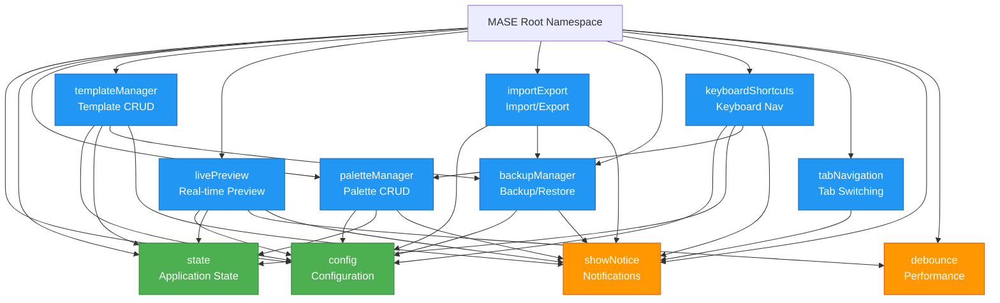
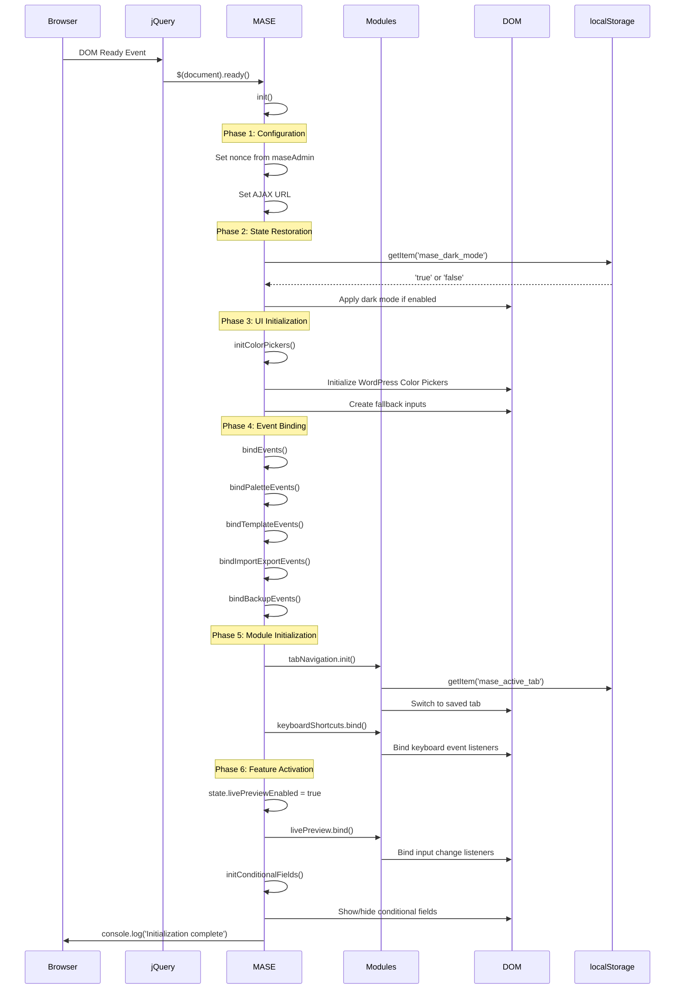
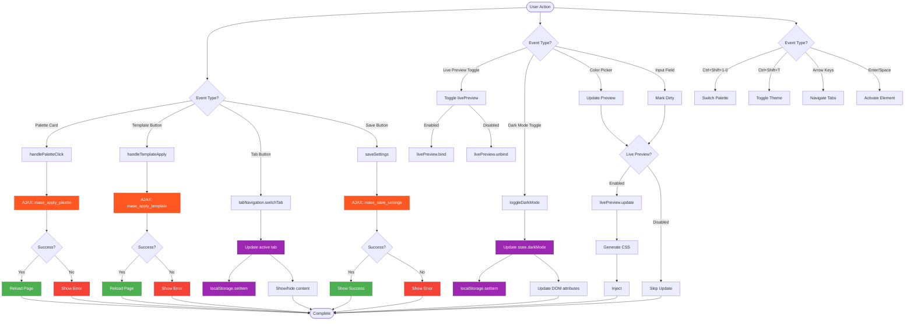
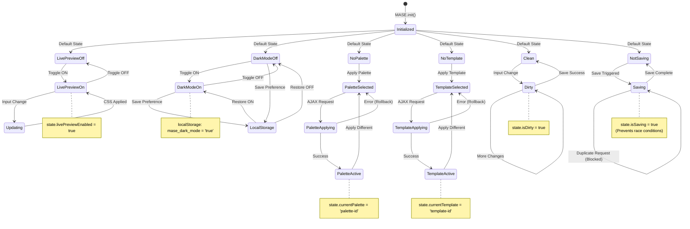
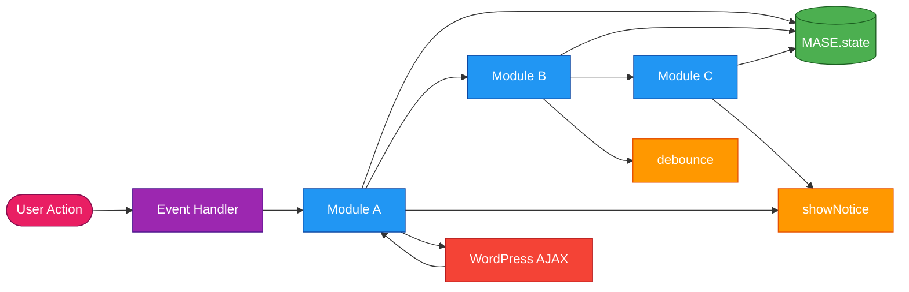
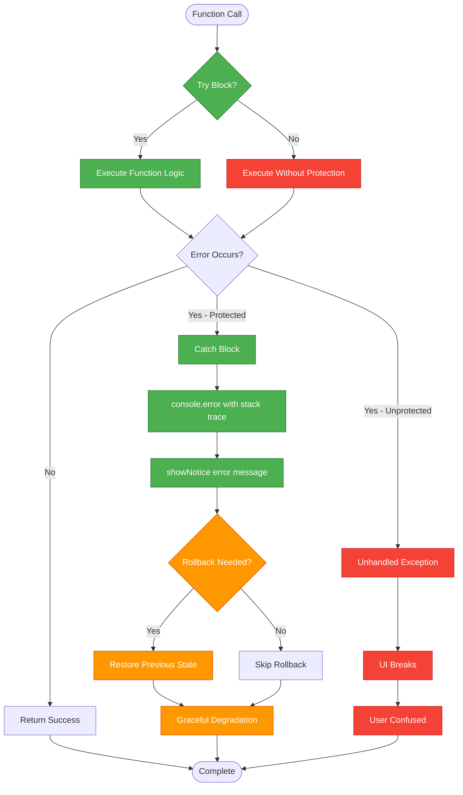
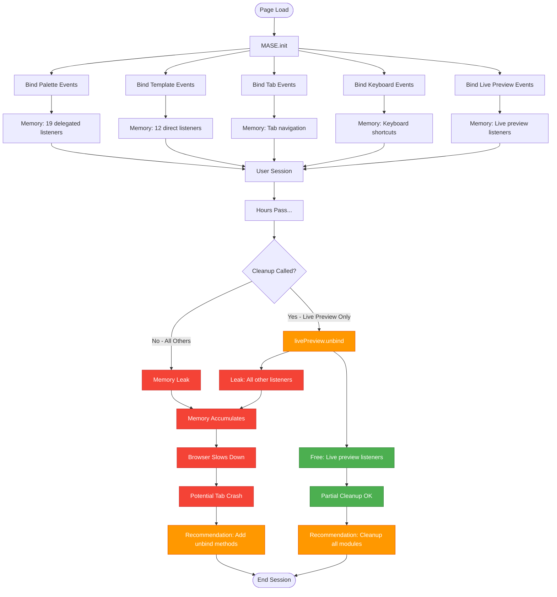

# JavaScript Dependency Diagram
## MASE Plugin Architecture Visualization

## Module Dependency Graph

## Initialization Sequence

## Event Flow Diagram

## State Management Flow

## Module Communication Pattern

## Error Handling Flow

## Memory Leak Analysis

---

## Legend

### Node Colors

- 🟢 **Green**: Core modules, successful operations
- 🔵 **Blue**: Feature modules, normal flow
- 🟠 **Orange**: Utility functions, warnings
- 🔴 **Red**: AJAX calls, errors, memory leaks
- 🟣 **Purple**: State management, event handlers

### Relationship Types

- **Solid Arrow** (→): Direct dependency or call
- **Dashed Arrow** (⇢): Conditional dependency
- **Bidirectional** (↔): Mutual dependency

---

## Key Insights from Diagrams

### 1. Clean Dependency Tree
- No circular dependencies
- Clear hierarchy: Core → Features → Utilities
- Easy to trace data flow

### 2. Centralized State
- All state in `MASE.state` object
- Modules read/write state directly
- No state synchronization mechanism

### 3. Event-Driven Architecture
- Heavy use of jQuery event delegation
- Delegated events for dynamic content
- Direct bindings for static elements

### 4. Memory Leak Risk
- Only live preview events are cleaned up
- All other listeners persist forever
- Potential for memory accumulation

### 5. Error Handling Gaps
- Only 10.2% of functions protected
- Unhandled exceptions can crash UI
- Need comprehensive try-catch coverage

---

**Generated:** 2025-10-19  
**Tool:** Mermaid Diagrams  
**Source:** `assets/js/mase-admin.js`
