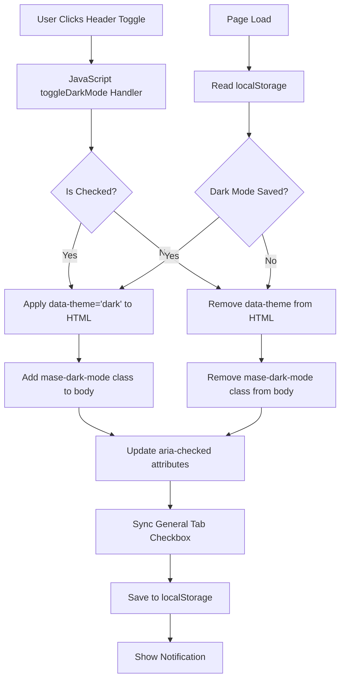

# Design Document

## Overview

This design adds a dark mode toggle to the MASE settings page header, making dark mode functionality more accessible and prominent. The toggle will be positioned before the existing Live Preview toggle in the header's right section, maintaining visual consistency with existing header controls while providing instant access to dark mode from any tab.

The implementation builds upon existing dark mode functionality (currently in the General tab) by:
1. Adding a header toggle control with the same visual style as Live Preview
2. Implementing JavaScript to synchronize both toggles (header and General tab)
3. Applying dark mode to the entire WordPress admin interface (not just settings page)
4. Persisting user preference via localStorage
5. Providing user feedback through notifications

## Architecture

### Component Structure

```
MASE Settings Page
├── Header (.mase-header)
│   ├── Left Section (.mase-header-left)
│   │   ├── Title
│   │   └── Version Badge
│   └── Right Section (.mase-header-right)
│       ├── **Dark Mode Toggle** ← NEW
│       ├── Live Preview Toggle
│       ├── Reset All Button
│       └── Save Settings Button
├── Tab Navigation
└── Content Area
    └── General Tab
        └── Master Controls
            └── Dark Mode Checkbox (existing)
```

### Data Flow



## Components and Interfaces

### 1. HTML Structure (admin-settings-page.php)

#### Location
File: `includes/admin-settings-page.php`
Line: ~52 (inside `.mase-header-right`, before Live Preview toggle)

#### New HTML Element

```php
<!-- Dark Mode Toggle -->
<label class="mase-header-toggle">
    <input 
        type="checkbox" 
        id="mase-dark-mode-toggle"
        name="mase_dark_mode" 
        value="1"
        <?php checked($settings['master']['dark_mode'] ?? false, true); ?>
        role="switch"
        aria-checked="<?php echo ($settings['master']['dark_mode'] ?? false) ? 'true' : 'false'; ?>"
        aria-label="<?php esc_attr_e('Toggle dark mode for entire admin', 'modern-admin-styler'); ?>"
    />
    <span class="dashicons dashicons-admin-appearance" aria-hidden="true"></span>
    <span><?php esc_html_e('Dark Mode', 'modern-admin-styler'); ?></span>
</label>
```

#### Key Design Decisions

1. **Reuse Existing Class**: Uses `.mase-header-toggle` class (same as Live Preview) for visual consistency
2. **Unique ID**: `mase-dark-mode-toggle` for JavaScript targeting
3. **Icon Choice**: `dashicons-admin-appearance` (moon/appearance icon) to represent dark mode
4. **Server-Side State**: Reads from `$settings['master']['dark_mode']` to show correct initial state
5. **Accessibility**: Includes `role="switch"`, `aria-checked`, and `aria-label` attributes

### 2. JavaScript Module (mase-admin.js)

#### Location
File: `assets/js/mase-admin.js`
Integration: Add to existing `MASE` object

#### New Method: toggleDarkMode()

```javascript
/**
 * Toggle Dark Mode
 * 
 * Toggles dark mode for the ENTIRE WordPress admin.
 * Applies data-theme="dark" to <html> element.
 * Saves preference to localStorage.
 * Syncs with form checkbox in General tab.
 * 
 * Requirements: 2.1, 2.2, 3.1, 3.2, 4.1, 5.1, 6.1
 * 
 * @param {Event} e - Change event from checkbox
 */
toggleDarkMode: function(e) {
    var self = MASE;
    var $checkbox = $(e.target);
    var isDark = $checkbox.is(':checked');
    
    console.log('MASE: Dark Mode toggled:', isDark ? 'ON' : 'OFF');
    
    // Apply to entire WordPress admin (Requirement 2.1, 2.2)
    if (isDark) {
        // Enable dark mode
        $('html').attr('data-theme', 'dark');
        $('body').addClass('mase-dark-mode');
        console.log('MASE: Dark mode enabled - applied to entire admin');
    } else {
        // Disable dark mode
        $('html').removeAttr('data-theme');
        $('body').removeClass('mase-dark-mode');
        console.log('MASE: Dark mode disabled');
    }
    
    // Update aria-checked for accessibility (Requirement 6.1, 6.4)
    $checkbox.attr('aria-checked', isDark ? 'true' : 'false');
    
    // Sync with form checkbox in General tab (Requirement 3.1, 3.2)
    $('#master-dark-mode')
        .prop('checked', isDark)
        .attr('aria-checked', isDark ? 'true' : 'false');
    
    // Save preference to localStorage (Requirement 4.1, 4.2)
    try {
        localStorage.setItem('mase_dark_mode', isDark ? 'true' : 'false');
        console.log('MASE: Dark mode preference saved to localStorage');
    } catch (error) {
        console.warn('MASE: Could not save dark mode to localStorage:', error);
    }
    
    // Show notification (Requirement 5.1, 5.2, 5.4)
    self.showNotice(
        'info',
        isDark ? 'Dark mode enabled' : 'Dark mode disabled'
    );
},
```

#### Event Binding (in bindEvents method)

```javascript
bindEvents: function() {
    var self = this;
    
    // ... existing event bindings ...
    
    // Dark Mode Toggle - Header (Requirement 3.1)
    $('#mase-dark-mode-toggle').on('change', self.toggleDarkMode.bind(self));
    
    // Dark Mode Toggle - General Tab Sync (Requirement 3.2)
    $('#master-dark-mode').on('change', function() {
        var isChecked = $(this).is(':checked');
        $('#mase-dark-mode-toggle')
            .prop('checked', isChecked)
            .trigger('change');
    });
},
```

#### Initialization (in init method)

```javascript
init: function() {
    var self = this;
    
    console.log('MASE Admin initializing...');
    
    // ... existing initialization code ...
    
    // Load saved dark mode preference (Requirement 4.2, 4.3, 4.5)
    try {
        var darkMode = localStorage.getItem('mase_dark_mode') === 'true';
        if (darkMode) {
            console.log('MASE: Loading saved dark mode preference');
            $('html').attr('data-theme', 'dark');
            $('body').addClass('mase-dark-mode');
            $('#mase-dark-mode-toggle')
                .prop('checked', true)
                .attr('aria-checked', 'true');
            $('#master-dark-mode')
                .prop('checked', true)
                .attr('aria-checked', 'true');
        }
    } catch (error) {
        console.warn('MASE: Could not load dark mode from localStorage:', error);
    }
    
    console.log('MASE Admin initialized successfully');
},
```

### 3. CSS Styles (mase-admin.css)

#### Location
File: `assets/css/mase-admin.css`

#### Existing Styles to Verify

The design assumes these dark mode styles already exist (from critical-fixes spec Task 2). We need to verify they are present:

```css
/* Dark Mode - Entire WordPress Admin */
html[data-theme="dark"],
body.mase-dark-mode {
    background: var(--mase-background);
    color: var(--mase-text);
}

/* Apply to WordPress admin wrapper */
html[data-theme="dark"] #wpwrap,
html[data-theme="dark"] #wpcontent,
html[data-theme="dark"] #wpbody,
html[data-theme="dark"] #wpbody-content {
    background: var(--mase-background);
    color: var(--mase-text);
}

/* Admin bar in dark mode */
html[data-theme="dark"] #wpadminbar {
    background: var(--mase-gray-900);
    color: var(--mase-text);
}

/* Admin menu in dark mode */
html[data-theme="dark"] #adminmenuwrap,
html[data-theme="dark"] #adminmenu {
    background: var(--mase-gray-800);
}

/* Cards and panels in dark mode */
html[data-theme="dark"] .mase-card,
html[data-theme="dark"] .mase-section-card,
html[data-theme="dark"] .postbox,
html[data-theme="dark"] .widefat {
    background: var(--mase-surface);
    border-color: var(--mase-gray-700);
    color: var(--mase-text);
}

/* Inputs in dark mode */
html[data-theme="dark"] input[type="text"],
html[data-theme="dark"] input[type="number"],
html[data-theme="dark"] textarea,
html[data-theme="dark"] select {
    background: var(--mase-gray-800);
    border-color: var(--mase-gray-700);
    color: var(--mase-text);
}
```

#### New Styles (if needed)

If the header toggle needs specific styling different from Live Preview:

```css
/* Dark Mode Toggle Specific Styles */
#mase-dark-mode-toggle {
    /* Inherits from .mase-header-toggle */
}

/* Dark mode toggle icon color */
.mase-header-toggle #mase-dark-mode-toggle ~ .dashicons-admin-appearance {
    color: var(--mase-gray-600);
}

/* Dark mode toggle icon when checked */
.mase-header-toggle #mase-dark-mode-toggle:checked ~ .dashicons-admin-appearance {
    color: var(--mase-primary);
}
```

## Data Models

### Settings Structure

The dark mode setting is stored in the `master` section of MASE settings:

```php
$settings = [
    'master' => [
        'enabled' => true,
        'apply_to_login' => false,
        'dark_mode' => false,  // ← Dark mode state
    ],
    // ... other settings sections
];
```

### localStorage Structure

```javascript
{
    'mase_dark_mode': 'true' | 'false'  // String representation of boolean
}
```

## Error Handling

### localStorage Errors

**Scenario**: localStorage is unavailable (private browsing, storage quota exceeded)

**Handling**:
```javascript
try {
    localStorage.setItem('mase_dark_mode', isDark ? 'true' : 'false');
    console.log('MASE: Dark mode preference saved to localStorage');
} catch (error) {
    console.warn('MASE: Could not save dark mode to localStorage:', error);
    // Continue without persistence - dark mode still works for current session
}
```

**User Impact**: Dark mode works but doesn't persist across page reloads

### Missing DOM Elements

**Scenario**: Toggle element not found (JavaScript loads before DOM ready)

**Handling**:
```javascript
$(document).ready(function() {
    MASE.init();  // Ensures DOM is ready before binding events
});
```

**User Impact**: None - initialization waits for DOM

### Sync Failures

**Scenario**: General tab checkbox doesn't exist (tab not rendered)

**Handling**:
```javascript
var $generalCheckbox = $('#master-dark-mode');
if ($generalCheckbox.length > 0) {
    $generalCheckbox.prop('checked', isDark).attr('aria-checked', isDark ? 'true' : 'false');
}
```

**User Impact**: Header toggle works independently if General tab checkbox is missing

## Testing Strategy

### Unit Tests

1. **Toggle State Management**
   - Test: Click header toggle → verify `data-theme` attribute applied
   - Test: Uncheck header toggle → verify `data-theme` attribute removed
   - Test: Verify `mase-dark-mode` class added/removed from body

2. **Synchronization**
   - Test: Change header toggle → verify General tab checkbox updates
   - Test: Change General tab checkbox → verify header toggle updates
   - Test: Verify aria-checked attributes sync on both controls

3. **Persistence**
   - Test: Enable dark mode → reload page → verify dark mode persists
   - Test: Disable dark mode → reload page → verify light mode persists
   - Test: Clear localStorage → reload → verify defaults to light mode

### Integration Tests

1. **Full Workflow**
   - Load settings page
   - Click dark mode toggle in header
   - Verify entire admin interface changes (admin bar, menu, content)
   - Switch to different tab
   - Verify dark mode persists
   - Reload page
   - Verify dark mode restored from localStorage

2. **Cross-Browser Testing**
   - Chrome: Test localStorage and CSS custom properties
   - Firefox: Test localStorage and CSS custom properties
   - Safari: Test localStorage and CSS custom properties
   - Edge: Test localStorage and CSS custom properties

### Accessibility Tests

1. **Keyboard Navigation**
   - Tab to dark mode toggle
   - Press Space to toggle
   - Verify focus indicator visible
   - Verify aria-checked updates

2. **Screen Reader**
   - Navigate to toggle with screen reader
   - Verify label announced: "Toggle dark mode for entire admin"
   - Toggle control
   - Verify state announced: "checked" or "not checked"
   - Verify notification announced

### Visual Tests

1. **Header Layout**
   - Verify dark mode toggle appears before Live Preview toggle
   - Verify icon and label display correctly
   - Verify spacing consistent with other header controls
   - Test responsive behavior on mobile

2. **Dark Mode Appearance**
   - Verify all admin areas styled correctly in dark mode
   - Verify text contrast meets WCAG AA standards
   - Verify form controls visible and usable
   - Verify no visual glitches or flashing

## Performance Considerations

### CSS Application

- **Approach**: Use CSS custom properties for instant theme switching
- **Performance**: No layout recalculation, only color changes
- **Optimization**: CSS variables already defined, no additional HTTP requests

### localStorage Operations

- **Read**: Synchronous operation in init() - minimal impact (<1ms)
- **Write**: Synchronous operation on toggle - minimal impact (<1ms)
- **Fallback**: Graceful degradation if localStorage unavailable

### DOM Manipulation

- **Minimal**: Only attribute changes (`data-theme`, `aria-checked`)
- **No Reflow**: Color changes don't trigger layout recalculation
- **Efficient**: jQuery selectors cached where possible

## Security Considerations

### XSS Prevention

- All PHP output uses proper escaping functions:
  - `esc_html_e()` for translatable text
  - `esc_attr_e()` for attributes
  - `checked()` for checkbox state

### CSRF Protection

- Not applicable - dark mode is client-side only (localStorage)
- No server-side state changes from toggle
- Settings save uses existing nonce verification

### localStorage Security

- Only stores boolean preference (no sensitive data)
- Same-origin policy prevents cross-site access
- No user-generated content stored

## Browser Compatibility

### Supported Browsers

- Chrome 90+ ✓
- Firefox 88+ ✓
- Safari 14+ ✓
- Edge 90+ ✓

### Required Features

- CSS Custom Properties (all supported browsers)
- localStorage API (all supported browsers)
- CSS attribute selectors `[data-theme="dark"]` (all supported browsers)
- jQuery 3.x (already required by WordPress)

### Fallbacks

- If localStorage unavailable: Dark mode works for current session only
- If CSS custom properties unsupported: Falls back to default light theme
- If JavaScript disabled: Toggle not functional (acceptable degradation)

## Migration Strategy

### Existing Users

1. **No Data Migration**: Dark mode setting already exists in database
2. **Backward Compatible**: Existing General tab checkbox continues to work
3. **Progressive Enhancement**: Header toggle adds convenience without breaking existing functionality

### New Users

1. **Default State**: Light mode (dark_mode = false)
2. **First Use**: User can enable from header or General tab
3. **Persistence**: Preference saved immediately to localStorage

## Future Enhancements

### Potential Improvements

1. **Auto Dark Mode**: Detect system preference using `prefers-color-scheme` media query
2. **Scheduled Dark Mode**: Auto-enable at sunset, disable at sunrise
3. **Custom Dark Themes**: Multiple dark color schemes to choose from
4. **Smooth Transitions**: Animated color transitions when toggling
5. **Per-Page Dark Mode**: Remember dark mode preference per admin page

### Technical Debt

None - this implementation builds cleanly on existing architecture without introducing technical debt.
