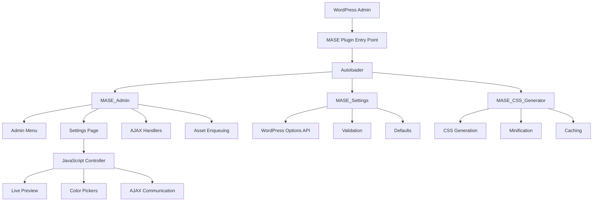

# Design Document: Modern Admin Styler Enterprise (MASE)

## Overview

Modern Admin Styler Enterprise (MASE) is a WordPress plugin that provides enterprise-grade admin interface customization through a clean, maintainable architecture. The design prioritizes simplicity, performance, and security while adhering to WordPress native patterns.

### Design Principles

1. **Simplicity First**: Maximum 15 files, single JavaScript file, no external dependencies
2. **WordPress Native**: Use only WordPress core APIs and patterns
3. **Performance Conscious**: CSS generation under 100ms, minimal memory footprint
4. **Security by Default**: Nonce verification, capability checks, input sanitization
5. **Progressive Enhancement**: Core functionality works without JavaScript

### Key Design Decisions

- **No REST API**: Traditional AJAX with wp_ajax hooks for simplicity
- **Single JavaScript File**: IIFE pattern to avoid module complexity
- **Transient Caching**: WordPress transients for CSS caching
- **Settings API**: WordPress Settings API for configuration management
- **PSR-4 Autoloading**: Standard autoloader for class loading

## Architecture

### High-Level Architecture



### Directory Structure

```
modern-admin-styler/
├── modern-admin-styler.php          # Main plugin file
├── includes/
│   ├── class-mase-settings.php      # Settings management
│   ├── class-mase-css-generator.php # CSS generation
│   ├── class-mase-admin.php         # Admin interface
│   └── class-mase-cache.php         # Cache management
├── assets/
│   ├── js/
│   │   └── mase-admin.js            # Single JavaScript file
│   └── css/
│       └── mase-admin.css           # Admin styles
├── tests/
│   ├── test-settings.php
│   ├── test-css-generator.php
│   └── test-admin.php
├── .gitignore
└── README.md
```

**Total Files: 13** (within 15-file constraint)

### Plugin Lifecycle

1. **Activation**: Register default settings, create options entry
2. **Load**: Register autoloader, instantiate core classes
3. **Admin Init**: Register settings, add menu, enqueue assets
4. **Runtime**: Generate CSS, inject into admin pages
5. **Deactivation**: Clean up transients (settings persist)

## Components and Interfaces

### 1. Main Plugin File (modern-admin-styler.php)

**Responsibilities:**

- Plugin header and metadata
- Autoloader registration
- Core class instantiation
- Activation/deactivation hooks

**Key Functions:**

```php
// Autoloader
function mase_autoloader( $class_name ) {
    if ( strpos( $class_name, 'MASE_' ) !== 0 ) return;
    $file = 'class-' . strtolower( str_replace( '_', '-', $class_name ) ) . '.php';
    $path = plugin_dir_path( __FILE__ ) . 'includes/' . $file;
    if ( file_exists( $path ) ) require_once $path;
}

// Activation
function mase_activate() {
    if ( version_compare( get_bloginfo( 'version' ), '5.0', '<' ) ) {
        deactivate_plugins( plugin_basename( __FILE__ ) );
        wp_die( 'MASE requires WordPress 5.0 or higher.' );
    }
    $settings = new MASE_Settings();
    $settings->initialize_defaults();
}

// Initialization
function mase_init() {
    if ( ! is_admin() ) return;
    $settings = new MASE_Settings();
    $generator = new MASE_CSS_Generator();
    $admin = new MASE_Admin( $settings, $generator );
}
```

### 2. MASE_Settings Class

**Purpose:** Centralized settings management with validation and defaults

**Public Methods:**

```php
class MASE_Settings {
    const OPTION_NAME = 'mase_settings';

    public function get_option( $key = null, $default = null );
    public function update_option( $data );
    public function get_defaults();
    public function validate( $input );
    public function reset_to_defaults();
}
```

**Settings Schema:**

```php
[
    'admin_bar' => [
        'bg_color' => '#23282d',
        'text_color' => '#ffffff',
        'height' => '32',
    ],
    'admin_menu' => [
        'bg_color' => '#23282d',
        'text_color' => '#ffffff',
        'hover_bg_color' => '#191e23',
        'hover_text_color' => '#00b9eb',
        'width' => '160',
    ],
    'performance' => [
        'enable_minification' => true,
        'cache_duration' => 3600,
    ],
]
```

**Validation Rules:**

- Colors: Must match `/^#[0-9A-Fa-f]{6}$/`
- Heights/Widths: Integer between 0-500
- Booleans: Cast to boolean
- Cache duration: Integer between 300-86400

### 3. MASE_CSS_Generator Class

**Purpose:** Generate and minify CSS from settings

**Public Methods:**

```php
class MASE_CSS_Generator {
    public function generate( $settings );
    public function minify( $css );
    private function generate_admin_bar_css( $settings );
    private function generate_admin_menu_css( $settings );
}
```

**CSS Generation Strategy:**

1. Build CSS string from settings using template literals
2. Apply specificity to avoid conflicts (use body.wp-admin prefix)
3. Minify if enabled (remove whitespace, comments)
4. Return CSS string

**Performance Optimization:**

- Use string concatenation (not array join) for speed
- Pre-calculate values once
- Avoid regex in hot paths
- Target: <100ms generation time

**Example Output:**

```css
body.wp-admin #wpadminbar {
  background-color: #23282d !important;
  color: #ffffff !important;
  height: 32px !important;
}
body.wp-admin #adminmenu {
  background-color: #23282d !important;
  width: 160px !important;
}
body.wp-admin #adminmenu a {
  color: #ffffff !important;
}
body.wp-admin #adminmenu a:hover {
  background-color: #191e23 !important;
  color: #00b9eb !important;
}
```

### 4. MASE_Admin Class

**Purpose:** Handle admin interface, AJAX, and asset management

**Public Methods:**

```php
class MASE_Admin {
    private $settings;
    private $generator;

    public function __construct( MASE_Settings $settings, MASE_CSS_Generator $generator );
    public function add_admin_menu();
    public function render_settings_page();
    public function enqueue_assets( $hook );
    public function inject_custom_css();
    public function handle_ajax_save_settings();
}
```

**Hook Registration:**

- `admin_menu` → add_admin_menu()
- `admin_enqueue_scripts` → enqueue_assets()
- `admin_head` → inject_custom_css()
- `wp_ajax_mase_save_settings` → handle_ajax_save_settings()

**Settings Page Structure:**

```html
<div class="wrap">
  <h1>Modern Admin Styler</h1>
  <form id="mase-settings-form">
    <?php wp_nonce_field( 'mase_save_settings', 'mase_nonce' ); ?>

    <h2>Admin Bar Settings</h2>
    <table class="form-table">
      <tr>
        <th>Background Color</th>
        <td>
          <input
            type="text"
            class="mase-color-picker"
            name="admin_bar[bg_color]"
          />
        </td>
      </tr>
      <!-- More fields -->
    </table>

    <h2>Admin Menu Settings</h2>
    <!-- Menu fields -->

    <?php submit_button( 'Save Settings' ); ?>
  </form>

  <div id="mase-preview-area">
    <!-- Live preview elements -->
  </div>
</div>
```

### 5. MASE_Cache Class

**Purpose:** Manage CSS caching with WordPress transients

**Public Methods:**

```php
class MASE_Cache {
    const CACHE_KEY = 'mase_generated_css';

    public function get_cached_css();
    public function set_cached_css( $css, $duration );
    public function invalidate_cache();
}
```

**Caching Strategy:**

- Cache key: `mase_generated_css`
- Default duration: 3600 seconds (1 hour)
- Invalidate on settings save
- Fallback to generation if cache miss

## Data Models

### Settings Data Model

**Storage:** WordPress options table as serialized array

**Structure:**

```php
[
    'admin_bar' => [
        'bg_color' => string,      // Hex color
        'text_color' => string,    // Hex color
        'height' => int,           // Pixels (0-500)
    ],
    'admin_menu' => [
        'bg_color' => string,
        'text_color' => string,
        'hover_bg_color' => string,
        'hover_text_color' => string,
        'width' => int,            // Pixels (0-500)
    ],
    'performance' => [
        'enable_minification' => bool,
        'cache_duration' => int,   // Seconds (300-86400)
    ],
]
```

**Default Values:**

- Admin Bar BG: `#23282d` (WordPress default)
- Admin Bar Text: `#ffffff`
- Admin Bar Height: `32px`
- Menu BG: `#23282d`
- Menu Text: `#ffffff`
- Menu Hover BG: `#191e23`
- Menu Hover Text: `#00b9eb`
- Menu Width: `160px`
- Minification: `true`
- Cache Duration: `3600` seconds

### CSS Cache Data Model

**Storage:** WordPress transients

**Structure:**

```php
[
    'css' => string,           // Generated CSS
    'hash' => string,          // MD5 of settings
    'generated_at' => int,     // Timestamp
]
```

## Error Handling

### Error Categories

1. **Validation Errors**: Invalid input data
2. **Permission Errors**: Unauthorized access
3. **Generation Errors**: CSS generation failures
4. **AJAX Errors**: Network or server errors

### Error Handling Strategy

**PHP Side:**

```php
// Validation errors
if ( ! $this->validate( $input ) ) {
    return new WP_Error( 'validation_failed', 'Invalid input data', $errors );
}

// Permission errors
if ( ! current_user_can( 'manage_options' ) ) {
    wp_send_json_error( [ 'message' => 'Unauthorized access' ], 403 );
}

// Generation errors
try {
    $css = $generator->generate( $settings );
} catch ( Exception $e ) {
    error_log( 'MASE CSS Generation Error: ' . $e->getMessage() );
    $css = get_transient( MASE_Cache::CACHE_KEY ); // Fallback to cache
}

// AJAX response format
wp_send_json_success( [
    'message' => 'Settings saved successfully',
    'css' => $css,
] );

wp_send_json_error( [
    'message' => 'Failed to save settings',
    'errors' => $validation_errors,
] );
```

**JavaScript Side:**

```javascript
// AJAX error handling
$.ajax({
  // ... config
  success: function (response) {
    if (response.success) {
      showNotice("success", response.data.message);
      updatePreview(response.data.css);
    } else {
      showNotice("error", response.data.message);
      highlightErrors(response.data.errors);
    }
  },
  error: function (xhr, status, error) {
    if (xhr.status === 403) {
      showNotice("error", "You do not have permission to perform this action.");
    } else {
      showNotice("error", "Network error. Please try again.");
    }
  },
});
```

### Graceful Degradation

1. **JavaScript Disabled**: Form submits normally, page reloads
2. **AJAX Fails**: Retry once, then fallback to form submission
3. **CSS Generation Fails**: Use cached CSS, log error
4. **Cache Miss**: Generate CSS on-the-fly
5. **Color Picker Fails**: Fallback to HTML5 color input

## Testing Strategy

### Unit Tests (PHPUnit)

**Test Coverage Requirements: 80% minimum**

**MASE_Settings Tests:**

- Test get_option() returns correct values
- Test update_option() saves to database
- Test validate() rejects invalid colors
- Test validate() rejects out-of-range numbers
- Test get_defaults() returns complete schema
- Test reset_to_defaults() restores defaults

**MASE_CSS_Generator Tests:**

- Test generate() produces valid CSS
- Test generate() completes under 100ms
- Test minify() removes whitespace
- Test minify() preserves CSS validity
- Test admin bar CSS generation
- Test admin menu CSS generation
- Test CSS specificity (body.wp-admin prefix)

**MASE_Admin Tests:**

- Test add_admin_menu() creates menu entry
- Test enqueue_assets() loads correct files
- Test inject_custom_css() outputs CSS
- Test AJAX handler validates nonce
- Test AJAX handler checks capabilities
- Test AJAX handler returns proper JSON

**MASE_Cache Tests:**

- Test get_cached_css() retrieves from transient
- Test set_cached_css() stores in transient
- Test invalidate_cache() deletes transient
- Test cache expiration behavior

### Integration Tests

- Test full settings save workflow
- Test CSS generation and injection pipeline
- Test AJAX save with live preview update
- Test cache invalidation on settings change
- Test multisite compatibility

### Performance Tests

- CSS generation time: <100ms
- Memory usage: <10MB plugin load
- Page load impact: <200ms
- JavaScript initialization: <50ms

### Security Tests

- Test nonce verification on AJAX
- Test capability checks on all operations
- Test XSS prevention (output escaping)
- Test input sanitization
- Test SQL injection prevention (prepared statements)

## JavaScript Architecture

### Single File Structure (mase-admin.js)

```javascript
(function ($) {
  "use strict";

  const MASE = {
    init: function () {
      this.initColorPickers();
      this.bindEvents();
      this.initLivePreview();
    },

    initColorPickers: function () {
      $(".mase-color-picker").wpColorPicker({
        change: $.debounce(200, this.updateLivePreview.bind(this)),
      });
    },

    bindEvents: function () {
      $("#mase-settings-form").on("submit", this.handleFormSubmit.bind(this));
      $(".mase-input").on(
        "input",
        $.debounce(200, this.updateLivePreview.bind(this))
      );
    },

    handleFormSubmit: function (e) {
      e.preventDefault();
      this.saveSettings();
    },

    saveSettings: function () {
      const $form = $("#mase-settings-form");
      const $button = $form.find('input[type="submit"]');

      $button.prop("disabled", true).val("Saving...");

      $.ajax({
        url: ajaxurl,
        type: "POST",
        data: {
          action: "mase_save_settings",
          nonce: $("#mase_nonce").val(),
          settings: $form.serializeArray(),
        },
        success: this.handleSaveSuccess.bind(this),
        error: this.handleSaveError.bind(this),
        complete: function () {
          $button.prop("disabled", false).val("Save Settings");
        },
      });
    },

    handleSaveSuccess: function (response) {
      if (response.success) {
        this.showNotice("success", response.data.message);
        this.updatePreviewCSS(response.data.css);
      } else {
        this.showNotice("error", response.data.message);
        this.highlightErrors(response.data.errors);
      }
    },

    handleSaveError: function (xhr) {
      if (xhr.status === 403) {
        this.showNotice("error", "Permission denied.");
      } else {
        this.showNotice("error", "Network error. Retrying...");
        setTimeout(this.saveSettings.bind(this), 1000);
      }
    },

    updateLivePreview: function () {
      const settings = this.getFormData();
      const css = this.generatePreviewCSS(settings);
      this.injectPreviewCSS(css);
    },

    generatePreviewCSS: function (settings) {
      // Mirror PHP CSS generation logic
      let css = "";
      css += `#wpadminbar { background-color: ${settings.admin_bar.bg_color} !important; }`;
      css += `#adminmenu { background-color: ${settings.admin_menu.bg_color} !important; }`;
      // ... more CSS generation
      return css;
    },

    injectPreviewCSS: function (css) {
      let $style = $("#mase-preview-style");
      if (!$style.length) {
        $style = $('<style id="mase-preview-style"></style>').appendTo("head");
      }
      $style.text(css);
    },

    showNotice: function (type, message) {
      const $notice = $(
        '<div class="notice notice-' +
          type +
          ' is-dismissible"><p>' +
          message +
          "</p></div>"
      );
      $(".wrap h1").after($notice);
      setTimeout(() => $notice.fadeOut(), 3000);
    },
  };

  $(document).ready(() => MASE.init());
})(jQuery);
```

### Debounce Utility

```javascript
$.debounce = function (delay, fn) {
  let timer = null;
  return function () {
    const context = this,
      args = arguments;
    clearTimeout(timer);
    timer = setTimeout(() => fn.apply(context, args), delay);
  };
};
```

## Security Implementation

### 1. Nonce Verification

**Settings Page:**

```php
wp_nonce_field( 'mase_save_settings', 'mase_nonce' );
```

**AJAX Handler:**

```php
if ( ! check_ajax_referer( 'mase_save_settings', 'nonce', false ) ) {
    wp_send_json_error( [ 'message' => 'Invalid nonce' ], 403 );
}
```

### 2. Capability Checks

```php
if ( ! current_user_can( 'manage_options' ) ) {
    wp_die( 'Unauthorized access' );
}
```

### 3. Input Sanitization

```php
$sanitized = [
    'admin_bar' => [
        'bg_color' => sanitize_hex_color( $input['admin_bar']['bg_color'] ),
        'text_color' => sanitize_hex_color( $input['admin_bar']['text_color'] ),
        'height' => absint( $input['admin_bar']['height'] ),
    ],
];
```

### 4. Output Escaping

```php
<input type="text" value="<?php echo esc_attr( $value ); ?>" />
<p><?php echo esc_html( $message ); ?></p>
<script>
    const data = <?php echo wp_json_encode( $data ); ?>;
</script>
```

### 5. SQL Injection Prevention

```php
// Use WordPress Options API (handles escaping internally)
update_option( 'mase_settings', $sanitized_data );
get_option( 'mase_settings', $defaults );
```

## Performance Optimization

### 1. CSS Caching Strategy

```php
public function get_css() {
    $cache = new MASE_Cache();
    $cached_css = $cache->get_cached_css();

    if ( $cached_css !== false ) {
        return $cached_css;
    }

    $settings = $this->settings->get_option();
    $css = $this->generator->generate( $settings );

    if ( $settings['performance']['enable_minification'] ) {
        $css = $this->generator->minify( $css );
    }

    $cache->set_cached_css( $css, $settings['performance']['cache_duration'] );

    return $css;
}
```

### 2. Asset Loading Optimization

```php
public function enqueue_assets( $hook ) {
    // Only load on our settings page
    if ( $hook !== 'toplevel_page_mase-settings' ) {
        return;
    }

    wp_enqueue_style( 'wp-color-picker' );
    wp_enqueue_script( 'wp-color-picker' );

    wp_enqueue_script(
        'mase-admin',
        plugins_url( 'assets/js/mase-admin.js', __FILE__ ),
        [ 'jquery', 'wp-color-picker' ],
        '1.0.0',
        true
    );
}
```

### 3. Memory Management

- Use unset() after large operations
- Avoid loading unnecessary data
- Stream CSS output directly
- Limit transient size

### 4. Database Optimization

- Single options entry (not multiple)
- Autoload set to 'no' for large data
- Use transients for temporary data
- Batch operations where possible

## WordPress Integration Patterns

### Hook Priority Strategy

```php
add_action( 'admin_menu', [ $this, 'add_admin_menu' ], 10 );
add_action( 'admin_init', [ $this, 'register_settings' ], 10 );
add_action( 'admin_enqueue_scripts', [ $this, 'enqueue_assets' ], 10 );
add_action( 'admin_head', [ $this, 'inject_custom_css' ], 999 ); // Late priority
```

### Multisite Support

```php
public function is_multisite_compatible() {
    if ( ! is_multisite() ) {
        return true;
    }

    // Use site-specific options
    $blog_id = get_current_blog_id();
    switch_to_blog( $blog_id );
    $settings = get_option( 'mase_settings' );
    restore_current_blog();

    return $settings;
}
```

### Theme Compatibility

```php
// Use high specificity to override theme styles
body.wp-admin #wpadminbar { /* styles */ }

// Detect conflicts
public function detect_theme_conflicts() {
    $theme = wp_get_theme();
    $known_conflicts = [ 'admin-theme-x', 'custom-admin-y' ];

    if ( in_array( $theme->get_stylesheet(), $known_conflicts ) ) {
        add_action( 'admin_notices', [ $this, 'show_conflict_notice' ] );
    }
}
```

## Accessibility Compliance

### WCAG AA Requirements

1. **Color Contrast**: Validate color combinations meet 4.5:1 ratio
2. **Keyboard Navigation**: All controls accessible via Tab/Enter
3. **Screen Reader Labels**: Proper aria-labels and for attributes
4. **Focus Indicators**: Visible focus states on all interactive elements

### Implementation

```html
<label for="admin-bar-bg-color">Admin Bar Background Color</label>
<input
  type="text"
  id="admin-bar-bg-color"
  class="mase-color-picker"
  aria-describedby="admin-bar-bg-color-desc"
/>
<p id="admin-bar-bg-color-desc" class="description">
  Choose the background color for the WordPress admin bar
</p>
```

```css
.mase-color-picker:focus {
  outline: 2px solid #0073aa;
  outline-offset: 2px;
}
```

## Design Rationale

### Why No REST API?

- **Simplicity**: Traditional AJAX is simpler and well-understood
- **Compatibility**: Works with all WordPress versions 5.0+
- **Performance**: No REST API overhead
- **Security**: Easier to implement nonce verification

### Why Single JavaScript File?

- **Constraint Compliance**: Meets 15-file maximum requirement
- **Simplicity**: No build process or module bundling
- **Performance**: Single HTTP request
- **Maintainability**: All client logic in one place

### Why Transient Caching?

- **WordPress Native**: Built-in WordPress feature
- **Automatic Cleanup**: WordPress handles expiration
- **Multisite Compatible**: Works across network
- **Simple API**: Easy to implement and test

### Why No External Dependencies?

- **Security**: Fewer attack vectors
- **Compatibility**: No version conflicts
- **Performance**: Smaller footprint
- **Maintenance**: No dependency updates needed

This design provides a solid foundation for implementing MASE while adhering to all requirements and constraints specified in the requirements document.
