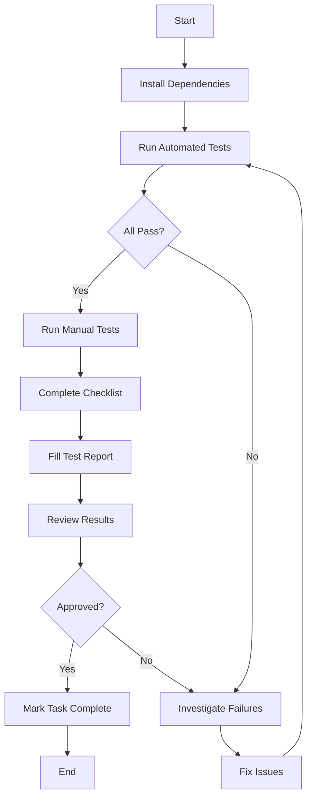

# Dark Mode Toggle - Cross-Browser Testing Index

## Overview

This directory contains comprehensive cross-browser compatibility tests for the dark mode toggle feature (Task 7 of header-dark-mode-toggle spec).

**Feature:** Dark Mode Toggle  
**Spec:** `.kiro/specs/header-dark-mode-toggle/`  
**Requirements:** All (1.1-7.5)

---

## Test Files

### Automated Tests

| File | Purpose | Usage |
|------|---------|-------|
| `test-dark-mode-cross-browser.js` | Playwright test suite for all browsers | `npx playwright test test-dark-mode-cross-browser.js` |
| `run-dark-mode-tests.sh` | Shell script to run all tests | `./run-dark-mode-tests.sh [browser]` |

### Manual Tests

| File | Purpose | Usage |
|------|---------|-------|
| `../test-dark-mode-toggle.html` | Interactive test page | Open in browser |
| `../test-dark-mode-restoration.html` | localStorage restoration test | Open in browser |

### Documentation

| File | Purpose |
|------|---------|
| `DARK-MODE-QUICK-START.md` | Quick start guide (5 min setup) |
| `dark-mode-browser-test-checklist.md` | Manual testing checklist |
| `DARK-MODE-TEST-REPORT.md` | Test report template |
| `DARK-MODE-INDEX.md` | This file |

---

## Quick Start

### 1. Install Dependencies (First Time Only)

```bash
cd tests/browser-compatibility
npm install --save-dev @playwright/test
npx playwright install
```

### 2. Run Automated Tests

```bash
# All browsers
./run-dark-mode-tests.sh

# Specific browser
./run-dark-mode-tests.sh chrome
./run-dark-mode-tests.sh firefox
./run-dark-mode-tests.sh safari
```

### 3. View Results

Results are saved to:
- `test-results/dark-mode/` - JSON result files
- `test-results/html-report/` - HTML report

---

## Test Coverage

### Automated Test Suites

1. **localStorage Support** (Requirements 4.1-4.5)
   - API availability
   - Save/restore functionality
   - Error handling

2. **CSS Custom Properties** (Requirements 2.1-2.5, 7.1-7.5)
   - Variable support
   - data-theme selector
   - Style application
   - Contrast ratios

3. **Dark Mode Appearance**
   - Visual consistency
   - Smooth transitions
   - No glitches

4. **Toggle Functionality** (Requirements 1.1-1.5, 3.1-3.5)
   - Click behavior
   - Synchronization
   - aria-checked updates

5. **Accessibility** (Requirements 6.1-6.5)
   - ARIA attributes
   - Keyboard navigation
   - Focus indicators

6. **JavaScript Functionality**
   - Error-free execution
   - Rapid toggling
   - Event handling

7. **Performance**
   - Response time
   - Memory usage
   - No leaks

8. **Browser-Specific Tests**
   - Chrome: Modern features
   - Firefox: Data attributes
   - Safari: Webkit prefixes
   - Edge: Chromium compatibility

### Manual Test Coverage

1. Visual appearance verification
2. User interaction testing
3. Edge case scenarios
4. Real-world usage patterns
5. Screen reader compatibility

---

## Supported Browsers

| Browser | Version | Status | Notes |
|---------|---------|--------|-------|
| Chrome | 90+ | ✅ Supported | Full support |
| Firefox | 88+ | ✅ Supported | Full support |
| Safari | 14+ | ✅ Supported | Full support |
| Edge | 90+ | ✅ Supported | Chromium-based |

---

## Test Results Location

### Automated Test Results

```
test-results/
├── dark-mode/
│   ├── chromium-comprehensive-[timestamp].json
│   ├── firefox-comprehensive-[timestamp].json
│   ├── webkit-comprehensive-[timestamp].json
│   ├── chromium-dark-mode-enabled-[timestamp].png
│   ├── firefox-dark-mode-enabled-[timestamp].png
│   └── webkit-dark-mode-enabled-[timestamp].png
└── html-report/
    └── index.html
```

### Manual Test Results

- Checklist: `dark-mode-browser-test-checklist.md` (fill in)
- Report: `DARK-MODE-TEST-REPORT.md` (fill in)

---

## Test Execution Workflow



---

## Requirements Verification Matrix

| Requirement | Chrome | Firefox | Safari | Edge | Test Method |
|-------------|--------|---------|--------|------|-------------|
| 1.1-1.5 Header Toggle | ⬜ | ⬜ | ⬜ | ⬜ | Automated + Manual |
| 2.1-2.5 Admin Dark Mode | ⬜ | ⬜ | ⬜ | ⬜ | Automated + Manual |
| 3.1-3.5 Synchronization | ⬜ | ⬜ | ⬜ | ⬜ | Automated |
| 4.1-4.5 Persistence | ⬜ | ⬜ | ⬜ | ⬜ | Automated |
| 5.1-5.5 User Feedback | ⬜ | ⬜ | ⬜ | ⬜ | Manual |
| 6.1-6.5 Accessibility | ⬜ | ⬜ | ⬜ | ⬜ | Automated + Manual |
| 7.1-7.5 CSS Styles | ⬜ | ⬜ | ⬜ | ⬜ | Automated + Manual |

Legend: ✅ Pass | ❌ Fail | ⚠️ Pass with Issues | ⬜ Not Tested

---

## Common Test Scenarios

### Scenario 1: Basic Functionality
1. Open test page
2. Click toggle
3. Verify dark mode applies
4. Reload page
5. Verify dark mode persists

### Scenario 2: Synchronization
1. Toggle header switch
2. Verify General tab updates
3. Toggle General tab
4. Verify header updates

### Scenario 3: Keyboard Access
1. Tab to toggle
2. Press Space
3. Verify toggle works
4. Verify focus visible

### Scenario 4: Error Handling
1. Fill localStorage quota
2. Toggle dark mode
3. Verify no errors
4. Verify graceful degradation

---

## Performance Benchmarks

### Target Metrics

| Metric | Target | Acceptable | Poor |
|--------|--------|------------|------|
| Toggle Response | < 50ms | < 100ms | > 100ms |
| Memory Increase | < 1MB | < 2MB | > 2MB |
| Page Load | < 1s | < 2s | > 2s |

### Actual Results

| Browser | Toggle (ms) | Memory (MB) | Load (ms) |
|---------|-------------|-------------|-----------|
| Chrome  | | | |
| Firefox | | | |
| Safari  | | | |
| Edge    | | | |

---

## Known Issues

### Browser-Specific Issues

**Chrome:**
- None known

**Firefox:**
- None known

**Safari:**
- localStorage unavailable in Private Browsing (expected, handled gracefully)

**Edge:**
- None known (Chromium-based, same as Chrome)

---

## Troubleshooting

### Tests Won't Run

**Problem:** `npx playwright test` fails  
**Solution:** Install Playwright: `npm install --save-dev @playwright/test`

**Problem:** Browser binaries missing  
**Solution:** Install browsers: `npx playwright install`

### Tests Fail

**Problem:** localStorage tests fail in Safari  
**Solution:** Check if Private Browsing is enabled (expected to fail)

**Problem:** Visual tests fail  
**Solution:** Check if dark mode CSS is loaded correctly

### Performance Issues

**Problem:** Toggle is slow  
**Solution:** Check for JavaScript errors, verify CSS is optimized

**Problem:** Memory leaks detected  
**Solution:** Check for event listener cleanup, verify no circular references

---

## Maintenance

### When to Update Tests

- New browser versions released
- Dark mode functionality changes
- New requirements added
- Issues discovered in production

### How to Update Tests

1. Update `test-dark-mode-cross-browser.js`
2. Update manual test checklist
3. Re-run all tests
4. Update documentation

---

## Resources

### Documentation
- [Requirements](../../.kiro/specs/header-dark-mode-toggle/requirements.md)
- [Design](../../.kiro/specs/header-dark-mode-toggle/design.md)
- [Tasks](../../.kiro/specs/header-dark-mode-toggle/tasks.md)

### External Resources
- [Playwright Documentation](https://playwright.dev/)
- [Can I Use](https://caniuse.com/)
- [MDN Web Docs](https://developer.mozilla.org/)
- [WCAG Guidelines](https://www.w3.org/WAI/WCAG21/quickref/)

### Related Tests
- `test-dark-mode-toggle.html` - Main interactive test
- `test-dark-mode-restoration.html` - Persistence test
- `test-template-system-fixes.js` - Template system tests (reference)

---

## Summary

This test suite provides comprehensive cross-browser compatibility testing for the dark mode toggle feature, covering:

✅ **Automated Tests** - Fast, repeatable, consistent  
✅ **Manual Tests** - Visual verification, user experience  
✅ **All Major Browsers** - Chrome, Firefox, Safari, Edge  
✅ **All Requirements** - Complete coverage of spec requirements  
✅ **Performance Metrics** - Response time, memory usage  
✅ **Accessibility** - ARIA, keyboard, screen readers  

**Estimated Time:** 1 hour for complete testing

**Next Steps:**
1. Read `DARK-MODE-QUICK-START.md`
2. Run automated tests
3. Perform manual tests
4. Complete `DARK-MODE-TEST-REPORT.md`

---

## Contact

For questions or issues with these tests, contact the development team or refer to the spec documentation.

**Last Updated:** [Date]  
**Version:** 1.0  
**Status:** Ready for Testing
